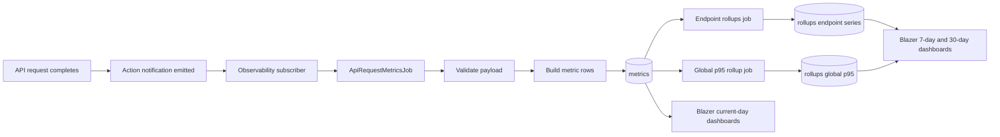

# ADR 0001: Endpoint-First API Metrics Modeling

## Status

Accepted

## Date

2026-06-19

## Context

The API observability pipeline originally produced multiple raw metrics per request, including separate error counters. As usage grew, this created extra write volume and duplicated semantics that could already be derived from endpoint dimensions and status labels.

At the same time, dashboards needed two different read patterns:

- very fresh current-day visibility
- efficient 7-day and 30-day trend queries

## Decision

Adopt an endpoint-first metrics model with mixed-source dashboard queries.

1. Raw ingestion writes only:
- observability.api.request.count
- observability.api.request.duration_ms

2. Endpoint rollups become the primary aggregate source:
- observability.api.endpoint.requests
- observability.api.endpoint.client_errors
- observability.api.endpoint.server_errors
- observability.api.endpoint.duration.avg_ms
- observability.api.endpoint.duration.p95_ms

3. Keep one global rollup for statistically correct latency:
- observability.api.duration.p95_ms

4. Query strategy in Blazer:
- current-day charts use raw metrics
- 7-day and 30-day charts use rollups

## Rationale

- Reduces raw metric cardinality and ingestion fanout.
- Keeps a single aggregate source of truth at endpoint level.
- Preserves accurate global p95 by computing it directly from raw duration data.
- Improves dashboard performance for longer windows while keeping current-day freshness.

## Consequences

Positive:

- Fewer raw rows per request.
- Clear separation between high-freshness and high-efficiency dashboard paths.
- Easier to evolve dashboard SQL without changing write-side instrumentation.

Tradeoffs:

- Error counts are derived, so they rely on consistent status labels.
- More responsibility in rollup jobs to keep derived series complete.

## Architecture Flow

## Related Docs

- ../metrics-model.md
