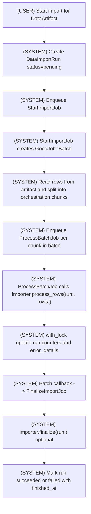

# Data Import Pipeline

This document describes the batch-oriented import architecture using GoodJob.

## Purpose

The import system separates concerns so large imports are observable, resumable, and operationally safe.

- `DataArtifact` stores uploaded file plus schema/version metadata.
- `DataImportRun` tracks one import attempt and its counters/status/errors.
- GoodJob batch jobs orchestrate chunked processing.
- Importer classes own validation, transforms, and persistence strategy.

## Architecture

```text
DataArtifact
	uploaded file + schema/version metadata

DataImportRun
	one attempt to import an artifact
	status/counts/errors/audit trail

StartImportJob
	top-level GoodJob batch job
	reads artifact
	splits rows into orchestration chunks (for example ~500 rows)
	enqueues ProcessBatchJob per chunk

ProcessBatchJob
	receives one chunk
	calls importer.process_rows(run:, rows:)
	updates DataImportRun counters/errors

FinalizeImportJob
	GoodJob batch callback
	runs importer.finalize(run:)
	marks run succeeded/failed
```

Important boundary:

- Jobs orchestrate execution and state transitions.
- Importers decide how rows are validated and persisted.
- Jobs do not encode persistence details.

## State Machines (AASM)

Pipeline status transitions are event-driven via `AASM` on the models.

### `DataArtifact` states

- `pending`
- `valid`
- `invalid`
- `imported`

Events:

- `validate_manifest` transitions to `valid`
- `invalidate_manifest` transitions to `invalid`
- `mark_imported` transitions `valid -> imported`

### `DataImportRun` states

- `pending`
- `running`
- `succeeded`
- `failed`
- `cancelled`

Events:

- `start_processing` transitions to `running`
- `mark_succeeded` transitions `running -> succeeded`
- `mark_failed` transitions to `failed` and records error details
- `cancel` transitions to `cancelled`

### Inspecting / visualizing transitions

AASM does not ship a built-in diagram rendering command. Use inspection commands to visualize the transition graph in text:

```bash
bin/rails runner 'puts "DataArtifact transitions:"; DataArtifact.aasm.events.each { |e| puts "- #{e.name}: #{e.transitions.map { |t| "#{Array(t.from).join("/")} -> #{t.to}" }.join(", ")}" }; puts; puts "DataImportRun transitions:"; DataImportRun.aasm.events.each { |e| puts "- #{e.name}: #{e.transitions.map { |t| "#{Array(t.from).join("/")} -> #{t.to}" }.join(", ")}" }'
```

You can also inspect runtime-permitted transitions for a record:

```bash
bin/rails runner 'run = DataImportRun.new; pp run.aasm.permitted_transitions'
```

## GoodJob Batch Flow



## Importer Contract

Importer classes should inherit from `DataImports::BaseImporter` and return structured totals for each invocation.

```ruby
class DataImports::BaseImporter
	Result = Data.define(
		:records_seen,
		:records_imported,
		:records_failed,
		:error_details
	)

	# Orchestration default. Importers may process sub-batches internally.
	def self.batch_size = 500

	def self.process_rows(run:, rows:)
		raise NotImplementedError
	end

	def self.finalize(run:)
		# optional
	end
end
```

Expected `process_rows` behavior:

- Validate and transform incoming rows.
- Persist according to importer strategy.
- Return `Result` with counts and structured row-level errors.

## Importer Strategy Recommendations

Default recommendation for most importers:

- Use `upsert_all` for validated rows per job chunk or importer sub-batch.
- Use `activerecord-import` when you specifically need its features
- Single-row persistence is not advised, but possible if you should find a reason to do so.

## Chunk Size Guidance

The rows sent to `ProcessBatchJob` are orchestration chunks, not a strict importer processing unit.

This means an importer can:

- process all received rows directly,
- split received rows into smaller internal slices,
- or stage and aggregate rows before persisting.

Why this matters:

- orchestration chunking keeps large files interruptible and non-blocking,
- importer-internal batching can tune memory and database write patterns,
- queue-level chunk size and persistence-level batch size can evolve independently.

## Counter Update Pattern

`ProcessBatchJob` should merge importer results into `DataImportRun` under a lock to avoid lost updates.

```ruby
run.with_lock do
	run.update!(
		records_seen: run.records_seen + result.records_seen,
		records_imported: run.records_imported + result.records_imported,
		records_failed: run.records_failed + result.records_failed,
		error_details: run.error_details + result.error_details
	)
end
```

## Operational Notes

- Keep importer operations idempotent where possible (natural keys + upsert patterns).
- Cap or summarize row errors for very large failures to avoid unbounded payload growth.
- Raise terminal errors for non-recoverable conditions so run status is accurate.
- Use `finalize` for post-import consistency checks or rollup steps, not core row ingestion.

