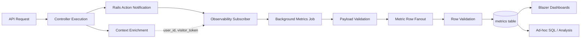

# Metrics Architecture

This application uses a first-party metrics architecture that captures behavior inside the Rails app, stores normalized measurements in the primary database, and powers operational dashboards from that data with Blazer.

## Design Intent

The metrics system is optimized for three goals:

- Reliable request-level telemetry for API endpoints
- Clear attribution for authenticated and anonymous traffic
- Fast aggregation for dashboards and incident debugging

At a high level, this is an event-to-metrics fanout model: one API request can produce multiple metric records (request count, duration, and conditional error counters). This also allows us to capture arbitrary data and move that to background processing for creating potentially multiple metric records, without adding latency to the request path.

### Compatibility / Portability

The fanout model allows us to capture single row metrics which reduces coupling and makes any forward compatible migrations easier. The schema was designed to be forward compatible with common dimensional models used in tools like Prometheus and OpenTelemetry, while also supporting rich contextual properties for debugging. The forward compatibility is experimental and as of this writing, unverified with any external systems.

## System Flow

## Architectural Boundaries

- Instrumentation trigger: Rails action notifications
- Ingestion scope: API controllers only
- Context ownership: controller layer enriches identity context
- Processing model: asynchronous job for durability and request-path isolation
- Data contract: dry-schema validation for ingestion payload and persisted rows
- Storage model: normalized metric rows with dimensions and contextual properties

## Metric Shape

Each stored record represents one measured fact with:

- A metric name
- A metric type (counter, histogram, gauge)
- A numeric value
- Occurrence timestamp
- Correlation and attribution context
- Dimensional labels for aggregation
- Additional properties for debugging context

This shape is intentionally compatible with dashboarding and export patterns used by systems like Prometheus and OpenTelemetry.

## Fanout Model

For each API request, the system emits:

- Request count
- Request duration
- Client error count for 4xx responses
- Server error count for 5xx responses

This gives both traffic volume and quality signals from the same request event stream.

## Operational View

The metrics table is the canonical source for:

- API traffic trends
- Endpoint hot spots
- Error-rate monitoring
- Latency distribution analysis

Blazer dashboards are generated from these stored metrics, and can be refreshed as dashboard definitions evolve.