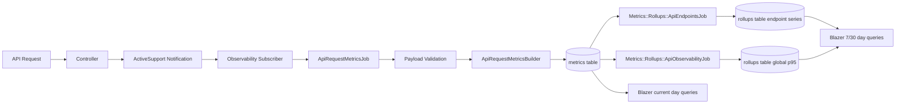

# Metrics Architecture

This application uses an endpoint-first observability model for API metrics. We capture request events in Rails, persist normalized raw metrics, produce endpoint rollups, and then build Blazer dashboards from a mix of raw metrics (current day) and rollups (7/30 day views).

## Design Intent

The current model is optimized for:

- One source of truth for traffic and error trends at endpoint level
- Accurate global latency p95 from raw duration data
- Dashboard performance for 7-day and 30-day windows via rollups

## Data Model

Per API request, the ingestion job writes two raw metrics:

- observability.api.request.count
- observability.api.request.duration_ms

Request status, controller, and action are stored in labels. That allows error metrics to be derived from request count rows instead of writing separate raw error metric names.

## Rollup Model

Endpoint rollups are the main dashboard source:

- observability.api.endpoint.requests
- observability.api.endpoint.client_errors
- observability.api.endpoint.server_errors
- observability.api.endpoint.duration.avg_ms
- observability.api.endpoint.duration.p95_ms

Global request and error charts are derived in SQL by aggregating endpoint rollups.

To preserve statistical correctness, one global latency rollup remains:

- observability.api.duration.p95_ms

This avoids incorrectly averaging endpoint p95 values.

## Dashboard Query Strategy

- Current day queries: read raw metrics for highest freshness and hourly detail.
- 7-day and 30-day queries: read rollups for lower query cost and faster dashboards.

## End-To-End Flow

## Operational Notes

- Raw metrics are retained for debugging and accurate recomputation.
- Endpoint rollups are treated as the primary aggregate layer for volume and error trends.
- Blazer dashboard SQL is intentionally simple at read time, with complexity pushed into rollup jobs.